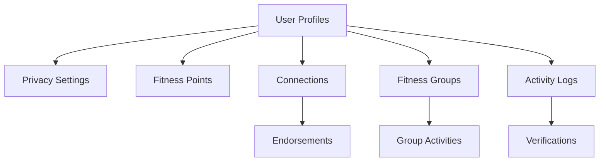

# FitGrid Social Fitness Network

A decentralized social fitness platform that connects users based on shared fitness goals, workout preferences, and geographic proximity. FitGrid enables users to discover workout partners, join fitness groups, and track collective progress through a blockchain-based reputation system.

## Overview

FitGrid is built on the Stacks blockchain using Clarity smart contracts. The platform facilitates social connections between fitness enthusiasts while maintaining user privacy and data control. Users earn fitness points through activities, verifications, and community engagement, creating a gamified experience that incentivizes active participation.

### Key Features
- User profiles with customizable privacy settings
- Social connections and endorsements
- Fitness group creation and management
- Activity logging and verification
- Reputation-based points system
- Community-driven governance

## Architecture



The system is built around a core smart contract that manages:
- User profile data with granular privacy controls
- Social connections and endorsements between users
- Fitness groups and their activities
- Activity logging and verification
- Points distribution and tracking

## Contract Documentation

### FitGrid Core Contract (`fitgrid-core.clar`)

#### Data Structures
- `users`: Stores user profiles and privacy settings
- `fitness-points`: Tracks user reputation points
- `connections`: Manages user relationships
- `endorsements`: Stores user-to-user endorsements
- `fitness-groups`: Manages group information
- `group-activities`: Tracks group events and workouts
- `activity-logs`: Records individual fitness activities

#### Key Functions

**Profile Management**
```clarity
(define-public (create-profile (username (string-ascii 30)) (bio (string-utf8 500)) ...))
(define-public (update-profile (bio (string-utf8 500)) (location (string-ascii 100)) ...))
(define-public (update-privacy-settings (bio-privacy uint) ...))
```

**Social Features**
```clarity
(define-public (request-connection (connection-id principal)))
(define-public (accept-connection (requestor principal)))
(define-public (endorse-user (user-id principal) (reason (string-utf8 200))))
```

**Group Management**
```clarity
(define-public (create-fitness-group (name (string-ascii 50)) ...))
(define-public (join-group (group-id uint)))
(define-public (create-group-activity (group-id uint) ...))
```

**Activity Tracking**
```clarity
(define-public (log-activity (activity-type (string-ascii 30)) ...))
(define-public (verify-activity (log-id uint)))
```

## Getting Started

### Prerequisites
- Clarinet
- Stacks wallet
- Node.js environment

### Installation
1. Clone the repository
2. Install dependencies
```bash
clarinet install
```
3. Run tests
```bash
clarinet test
```

## Function Reference

### User Management

```clarity
;; Create a new user profile
(contract-call? .fitgrid-core create-profile 
    "username" 
    "bio" 
    "location" 
    (list) 
    (list))

;; Request a connection
(contract-call? .fitgrid-core request-connection 
    'SP2J6ZY48GV1EZ5V2V5RB9MP66SW86PYKKNRV9EJ7)
```

### Group Management

```clarity
;; Create a fitness group
(contract-call? .fitgrid-core create-fitness-group 
    "Group Name" 
    "Description" 
    "Running")

;; Create a group activity
(contract-call? .fitgrid-core create-group-activity 
    u1 
    "Activity Name" 
    "Description" 
    u1234567890)
```

## Development

### Testing
The contract includes test cases covering:
- Profile creation and updates
- Privacy settings
- Connection management
- Group operations
- Activity logging and verification

Run tests using:
```bash
clarinet test
```

### Local Development
1. Start Clarinet console:
```bash
clarinet console
```
2. Deploy contract:
```clarity
::deploy_contract fitgrid-core
```

## Security Considerations

### Privacy
- All user data has configurable privacy levels
- Private data is only accessible to authorized connections
- Endorsements require active connections

### Access Control
- Group administrative actions restricted to admins
- Activity verification requires separate users
- Connection requests require mutual acceptance

### Limitations
- Maximum 20 achievements per user
- Maximum 5 admins per group
- Rate limiting on point accumulation
- Cannot endorse self or verify own activities